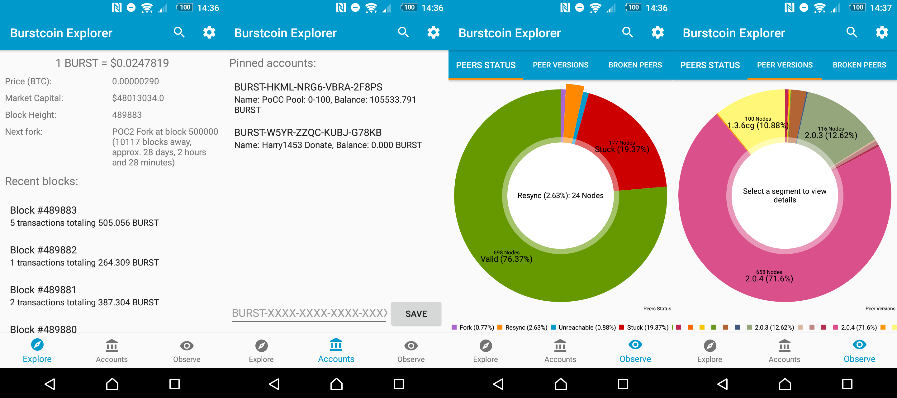

# Burstcoin Explorer

Burstcoin explorer is a block explorer for the Burstcoin network!

It is currently available for Android.

Features include:
- Search for and view blocks, accounts and transactions
- Keep a list of accounts you are watching
- Keep an eye on the current Burst price, both in BTC and USD
- Observe the current status of the Burstcoin Network, including Node Status, Node Versions, Node Locations and Broken Nodes.
- Countdown upcoming events such as the Pre-Dymaxion Hard Fork!

# Download
Get our latest release on [Google Play](https://play.google.com/store/apps/details?id=com.harrysoft.burstcoinexplorer) or on our [releases page](https://github.com/harry1453/burstcoin-explorer-android/releases/latest)

# Screenshots

# Build
- Download Android Studio and the Android SDK
- Clone the repository
- Open the repository and build

# Forking
This project is licensed under the MIT license.
Please, if you decide to fork, obey the conditions set out in the license.

# Contributing
For small contributions, please fork and open a pull request for your work to be merged.
Please bear in mind the software patterns this project follows, specifically use of RxJava, Dagger2 and Android Architecture Components.

This project also utilises [Burstcoin-Java](https://github.com/harry1453/burstcoin-java).

For larger contributions, or to be added as a collaborator, please contact me (Telegram: [@harry1453](https://t.me/harry1453)).

# Internationalization
Please message me if you want to help out with internationalization (Telegram: [@harry1453](https://t.me/harry1453)).

# Donate
All donations, however small, are appreciated!
BURST: `BURST-W5YR-ZZQC-KUBJ-G78KB`
